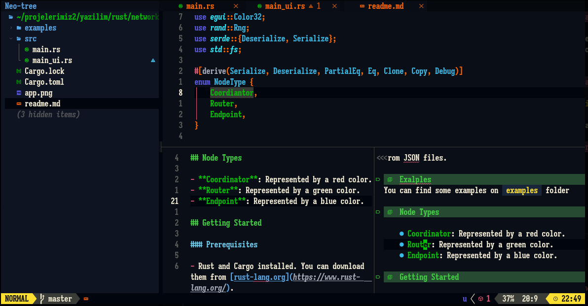

# 💤 LazyVim

A starter template for [LazyVim](https://github.com/LazyVim/LazyVim).
Refer to the [documentation](https://lazyvim.github.io/installation) to get started.


# Installation
```console
./nvim_installer.sh
```
It install all dependicies and font installation on your folder

# Galery
 

